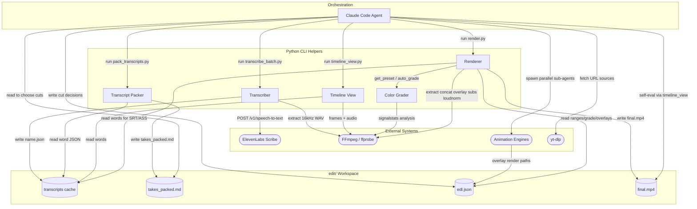

# Architecture

> video-use is a Claude Code skill (not a running server) in which an LLM agent conversationally edits video by driving a set of stateless Python CLI helpers over a shared file workspace (<videos_dir>/edit/). The agent transcribes footage via the ElevenLabs Scribe API, reads a packed phrase-level transcript instead of watching frames, writes cut decisions to an EDL JSON, and renders the final cut with ffmpeg; animation overlays are produced by parallel sub-agents using HyperFrames/Remotion/Manim/PIL. Every stage passes data through files on disk rather than over the network or a queue.

## Components

| Component | Type | Port | Key files | Prompt files |
|---|---|---|---|---|
| Claude Code Agent (orchestrator) | cli | — | `SKILL.md`, `install.md`, `README.md` | `SKILL.md`, `install.md` |
| Transcriber | worker | — | `helpers/transcribe.py`, `helpers/transcribe_batch.py` | — |
| Transcript Packer | cli | — | `helpers/pack_transcripts.py` | — |
| Timeline View | cli | — | `helpers/timeline_view.py` | — |
| Renderer | cli | — | `helpers/render.py` | — |
| Color Grader | library | — | `helpers/grade.py` | — |
| ElevenLabs Scribe API | external | — | — | — |
| FFmpeg / ffprobe | external | — | — | — |
| Animation Engines (HyperFrames / Remotion / Manim / PIL) | external | — | `skills/manim-video/SKILL.md` | `skills/manim-video/SKILL.md` |
| yt-dlp | external | — | — | — |
| transcripts cache | database | — | — | — |
| takes_packed.md | database | — | — | — |
| edl.json | database | — | — | — |
| final.mp4 / preview.mp4 | database | — | — | — |

## Tech Stack

| Name | Category | Version |
|---|---|---|
| Python | runtime | `>=3.10` |
| requests | library | `unpinned` |
| numpy | library | `unpinned` |
| Pillow | library | `12.2.0` |
| librosa | library | `unpinned` |
| matplotlib | library | `unpinned` |
| manim | library | `optional extra` |
| FFmpeg/ffprobe | tool | `>=4.x` |
| ElevenLabs Scribe | api | `scribe_v1` |
| yt-dlp | tool | `optional` |
| HyperFrames / Remotion / Manim | tool | `per-slot, lazy` |

<!-- Generated by architecture-analyst-breakdown. Machine-readable payload below; do not edit. -->
<!-- archdata: {"pattern":"Agent-Orchestrated Pipeline","summary":"video-use is a Claude Code skill (not a running server) in which an LLM agent conversationally edits video by driving a set of stateless Python CLI helpers over a shared file workspace (<videos_dir>/edit/). The agent transcribes footage via the ElevenLabs Scribe API, reads a packed phrase-level transcript instead of watching frames, writes cut decisions to an EDL JSON, and renders the final cut with ffmpeg; animation overlays are produced by parallel sub-agents using HyperFrames/Remotion/Manim/PIL. Every stage passes data through files on disk rather than over the network or a queue.","mermaid":"flowchart TB\n  subgraph orchestration[\"Orchestration\"]\n    agent[\"Claude Code Agent\"]\n  end\n  subgraph helpers[\"Python CLI Helpers\"]\n    transcribe[\"Transcriber\"]\n    pack[\"Transcript Packer\"]\n    timeline[\"Timeline View\"]\n    render[\"Renderer\"]\n    grade[\"Color Grader\"]\n  end\n  subgraph workspace[\"edit/ Workspace\"]\n    transcriptsStore[(\"transcripts cache\")]\n    packedStore[(\"takes_packed.md\")]\n    edlStore[(\"edl.json\")]\n    finalStore[(\"final.mp4\")]\n  end\n  subgraph external[\"External Systems\"]\n    elevenlabs([\"ElevenLabs Scribe\"])\n    ffmpeg([\"FFmpeg / ffprobe\"])\n    animengines([\"Animation Engines\"])\n    ytdlp([\"yt-dlp\"])\n  end\n  agent -->|\"fetch URL sources\"| ytdlp\n  agent -->|\"run transcribe_batch.py\"| transcribe\n  transcribe -->|\"extract 16kHz WAV\"| ffmpeg\n  transcribe -->|\"POST /v1/speech-to-text\"| elevenlabs\n  transcribe -->|\"write name.json\"| transcriptsStore\n  agent -->|\"run pack_transcripts.py\"| pack\n  pack -->|\"read word JSON\"| transcriptsStore\n  pack -->|\"write takes_packed.md\"| packedStore\n  agent -->|\"read to choose cuts\"| packedStore\n  agent -->|\"run timeline_view.py\"| timeline\n  timeline -->|\"frames + audio\"| ffmpeg\n  timeline -->|\"read words\"| transcriptsStore\n  agent -->|\"write cut decisions\"| edlStore\n  agent -->|\"spawn parallel sub-agents\"| animengines\n  animengines -->|\"overlay render paths\"| edlStore\n  agent -->|\"run render.py\"| render\n  render -->|\"read ranges/grade/overlays\"| edlStore\n  render -->|\"get_preset / auto_grade\"| grade\n  grade -->|\"signalstats analysis\"| ffmpeg\n  render -->|\"read words for SRT/ASS\"| transcriptsStore\n  render -->|\"extract concat overlay subs loudnorm\"| ffmpeg\n  render -->|\"write final.mp4\"| finalStore\n  agent -->|\"self-eval via timeline_view\"| finalStore","components":[{"id":"agent","name":"Claude Code Agent (orchestrator)","type":"cli","keyFiles":["SKILL.md","install.md","README.md"],"promptFiles":["SKILL.md","install.md"],"description":"The LLM conductor: follows SKILL.md's rules to inventory sources, converse, plan, invoke helpers, spawn animation sub-agents, and self-evaluate the render; holds no long-running process."},{"id":"transcribe","name":"Transcriber","type":"worker","keyFiles":["helpers/transcribe.py","helpers/transcribe_batch.py"],"description":"Extracts 16kHz mono WAV via ffmpeg and uploads to ElevenLabs Scribe for word-level verbatim transcripts; transcribe_batch.py runs 4 parallel workers; results cached per source."},{"id":"pack","name":"Transcript Packer","type":"cli","keyFiles":["helpers/pack_transcripts.py"],"description":"Groups Scribe word JSON into phrase-level lines (break on >=0.5s silence or speaker change) and writes takes_packed.md, the agent's primary reading surface."},{"id":"timeline","name":"Timeline View","type":"cli","keyFiles":["helpers/timeline_view.py"],"description":"On-demand visual drill-down: extracts frames + audio envelope via ffmpeg and renders a filmstrip+waveform+word-label PNG for a time range using PIL/numpy."},{"id":"render","name":"Renderer","type":"cli","keyFiles":["helpers/render.py"],"description":"Reads edl.json and drives the full ffmpeg pipeline: per-segment extract+grade+audio-fades, lossless concat, PTS-shifted overlays, subtitles LAST, and two-pass loudnorm to final.mp4."},{"id":"grade","name":"Color Grader","type":"library","keyFiles":["helpers/grade.py"],"description":"Provides named grade presets and a data-driven per-clip auto-grade (ffmpeg signalstats analysis, bounded +/-8%); imported by render.py and usable standalone."},{"id":"elevenlabs","name":"ElevenLabs Scribe API","type":"external","keyFiles":[],"description":"Hosted speech-to-text (model scribe_v1) providing word timestamps, diarization, and audio-event tagging over HTTPS."},{"id":"ffmpeg","name":"FFmpeg / ffprobe","type":"external","keyFiles":[],"description":"The universal media engine every helper shells out to for probing, audio extraction, frame grabs, encoding, filtering, and concat."},{"id":"animengines","name":"Animation Engines (HyperFrames / Remotion / Manim / PIL)","type":"external","keyFiles":["skills/manim-video/SKILL.md"],"promptFiles":["skills/manim-video/SKILL.md"],"description":"Per-slot overlay renderers invoked by parallel sub-agents; each writes render.mp4/webm into edit/animations/slot_<id>/ referenced by the EDL overlays."},{"id":"ytdlp","name":"yt-dlp","type":"external","keyFiles":[],"description":"Optional downloader that pulls online source videos into edit/downloads/ when the user supplies URLs."},{"id":"transcriptsStore","name":"transcripts cache","type":"database","keyFiles":[],"description":"edit/transcripts/<name>.json — cached raw Scribe responses, the immutable source of word timing for packing, subtitles, and timeline labels."},{"id":"packedStore","name":"takes_packed.md","type":"database","keyFiles":[],"description":"The ~12KB phrase-level transcript view the agent reads to choose cuts."},{"id":"edlStore","name":"edl.json","type":"database","keyFiles":[],"description":"The edit decision list: sources, cut ranges, grade, overlays, and subtitle reference — the contract between the agent's reasoning and the renderer."},{"id":"finalStore","name":"final.mp4 / preview.mp4","type":"database","keyFiles":[],"description":"Rendered output in <videos_dir>/edit/, re-examined by the agent via timeline_view during self-eval."}],"edges":[{"from":"agent","to":"ytdlp","label":"invokes CLI to fetch URL sources → edit/downloads/"},{"from":"agent","to":"transcribe","label":"runs transcribe_batch.py <videos_dir>"},{"from":"transcribe","to":"ffmpeg","label":"extract mono 16kHz WAV"},{"from":"transcribe","to":"elevenlabs","label":"POST /v1/speech-to-text (multipart WAV, scribe_v1)"},{"from":"transcribe","to":"transcriptsStore","label":"writes <name>.json (cached)"},{"from":"agent","to":"pack","label":"runs pack_transcripts.py --edit-dir"},{"from":"pack","to":"transcriptsStore","label":"reads word-level JSON"},{"from":"pack","to":"packedStore","label":"writes takes_packed.md"},{"from":"agent","to":"packedStore","label":"reads phrase transcript to choose cuts"},{"from":"agent","to":"timeline","label":"runs timeline_view.py at decision points"},{"from":"timeline","to":"ffmpeg","label":"extract frames + audio envelope"},{"from":"timeline","to":"transcriptsStore","label":"reads words for labels + silence gaps"},{"from":"agent","to":"edlStore","label":"writes cut decisions (JSON)"},{"from":"agent","to":"animengines","label":"spawns parallel sub-agents to render overlays"},{"from":"animengines","to":"edlStore","label":"overlay render.mp4 paths referenced in EDL"},{"from":"agent","to":"render","label":"runs render.py <edl.json> -o final.mp4"},{"from":"render","to":"edlStore","label":"reads ranges, grade, overlays, subtitles"},{"from":"render","to":"grade","label":"get_preset / auto_grade_for_clip()"},{"from":"grade","to":"ffmpeg","label":"signalstats frame analysis"},{"from":"render","to":"transcriptsStore","label":"reads words to build master SRT/ASS"},{"from":"render","to":"ffmpeg","label":"extract → concat → overlay → subtitles → loudnorm"},{"from":"render","to":"finalStore","label":"writes final.mp4 / preview.mp4"},{"from":"agent","to":"finalStore","label":"self-eval via timeline_view on rendered output"}],"techStack":[{"name":"Python","category":"runtime","version":">=3.10","source":"pyproject.toml"},{"name":"requests","category":"library","version":"unpinned","source":"ai"},{"name":"numpy","category":"library","version":"unpinned","source":"ai"},{"name":"Pillow","category":"library","version":"12.2.0","source":"ai"},{"name":"librosa","category":"library","version":"unpinned","source":"ai"},{"name":"matplotlib","category":"library","version":"unpinned","source":"ai"},{"name":"manim","category":"library","version":"optional extra","source":"ai"},{"name":"FFmpeg/ffprobe","category":"tool","version":">=4.x","source":"ai"},{"name":"ElevenLabs Scribe","category":"api","version":"scribe_v1","source":"ai"},{"name":"yt-dlp","category":"tool","version":"optional","source":"ai"},{"name":"HyperFrames / Remotion / Manim","category":"tool","version":"per-slot, lazy","source":"ai"}]} -->
